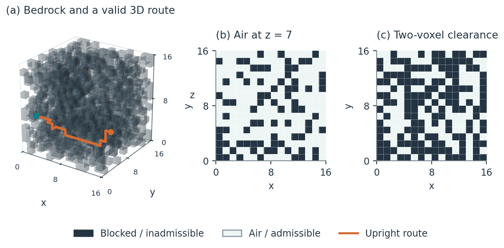

# 3D Labyrinth

**A Two-Thirds-Air, One-Third-Bedrock Random Voxel Maze**  
Kaoru Aguilera Katayama — October 6, 2026  
Repository edition: October 7, 2026

[Read the paper (PDF)](3d_labyrinth.pdf) ·
[LaTeX source](3d_labyrinth.tex) ·
[Raw experimental data](data/trials.csv)

Project repository: **https://github.com/PolloXDDD/3D-Labyrinth**

This package contains the English paper, five original scientific figures, and
the complete computational experiment. Minecraft is not required.



The generator independently assigns each voxel air with probability 2/3 and
bedrock with probability 1/3. The paper formalizes this construction and
compares single-voxel navigation with translation of an upright two-voxel body
across 9,300 independently generated cubes.

## Read or compile the paper

- 3d_labyrinth.pdf: compiled paper.
- 3d_labyrinth.tex: main LaTeX source, including the preamble.
- references.bib: six verified references.
- figures/*.pdf: vector figure assets used by LaTeX.

To compile locally:

~~~sh
pdflatex 3d_labyrinth.tex
bibtex 3d_labyrinth
pdflatex 3d_labyrinth.tex
pdflatex 3d_labyrinth.tex
~~~

In Overleaf, upload the complete source ZIP and select 3d_labyrinth.tex as the
main document. No Python execution is necessary to compile the provided paper.
The TEX file uses the companion figures and bibliography; keep them together.

To obtain the repository locally:

~~~sh
git clone https://github.com/PolloXDDD/3D-Labyrinth.git
cd 3D-Labyrinth
~~~

## Reproduce the experiments

The scripts were executed on Linux with Python 3.12.14 and a C++17 compiler.
The exact installed Python package versions are in requirements.txt.

~~~sh
python simulate.py
python figures.py
~~~

The simulation script compiles bfs.cpp with g++ into a temporary _bfs.so in the
project directory. Override the compiler using CXX if needed. Run the scripts
from any working directory: paths are resolved relative to the script.
The compiled library is intentionally omitted from the archive.

The density sweep uses 8,400 cubes, and the focused experiment at air
probability 2/3 uses another 900. Each cube is evaluated using both a one-voxel
graph and a vertical two-voxel-body graph. These paired observations are not
independent samples. One additional fixed-seed realization illustrates the
geometry. No acceptance/rejection filtering was used in the experiments.

The figure script regenerates the five figures, summary data, and the marked
results table inside the manuscript. The prose contains the reported
experimental results, so changing the experimental design also requires
updating that prose.

## Data

| File | Contents |
| --- | --- |
| data/trials.csv | 18,600 graph observations, one row per graph and cube. |
| data/metadata.json | Seed design, parameters, environment, verification. |
| data/summary.json and .csv | Focused experiment summary statistics. |
| data/moment_checks.json | Analytic versus empirical vertex and edge means. |
| data/illustration.npz | The illustration's air mask and both shortest paths. |

The master seed is 20261006. Seed fields are
[master_seed, experiment, L, p_index, trial, stream]. Experiment 1 is the
density sweep, experiment 2 is the focused experiment, and experiment 3 is the
illustration. The ordered probabilities are stored in the metadata. Stream 0
generates the volume; streams 1 and 2 select random admissible entries.

### Trial columns

- air_fraction: realized air count divided by L cubed.
- vertices, edges, components, cycle_rank: realized graph counts.
- giant_fraction: largest component divided by total admissible vertices.
- spanning: whether any admissible entry on x=0 reaches x=L-1.
- useful_face_fraction: successful entries divided by all possible face
  locations, including blocked ones.
- useful_open_fraction: successful entries divided by admissible face entries.
- shortest_face: best face-to-face distance, minimizing over all entries.
- random_start: C-order flat index of one uniformly sampled admissible entry.
- random_length and random_success: its shortest exit distance and success.
- solid_spanning and solid_giant: properties of the complementary bedrock graph,
  repeated on the paired point/upright records for the same cube.

Focused-only columns are empty in the sweep. Unreachable distances use -1;
zero denominators yield zero fractions. In both graphs, z is vertical.
Paths remain within the cube. Upright motion allows free vertical translation,
so it does not implement walking, gravity, jumping, or full Minecraft physics.

The simulation script verifies the compiled BFS against an independent Python
BFS, checks route validity and component agreement, and checks full-lattice
cases. Observed moments agree with the paper's exact formulas within one
estimated standard error in all twelve focused comparisons.

## Origin

The 3D Labyrinth originated from a Minecraft experiment conceived by **Kaoru Aguilera Katayama** on October 6, 2026.

The original WorldEdit command was:

```
//set air,air,bedrock
```

The idea was simple: generate a three-dimensional random labyrinth containing approximately two-thirds air and one-third bedrock.

What began as a Minecraft experiment evolved into a mathematical investigation of random voxel structures, graph connectivity, percolation, and pathfinding.

**AI Assistance and Acknowledgment**

The original idea, conceptual design, and Minecraft prototype belong to Kaoru Aguilera Katayama.

OpenAI's ChatGPT assisted with mathematical formalization, scientific writing, programming, computational experiments, visualization, and manuscript preparation.

The author acknowledges the use of AI tools transparently. The computational results are intended to be reproducible through the publicly available source code and experimental data.

The experiments use newly generated mathematical voxel cubes rather than direct captures of the original Minecraft world.

## License

See the repository's [MIT License](LICENSE).
